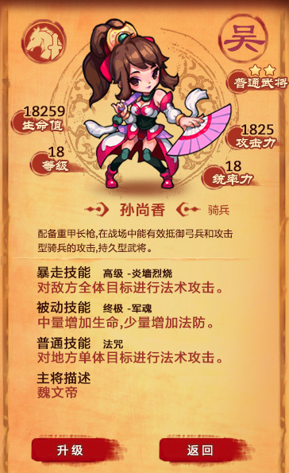
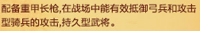
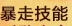
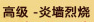
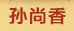
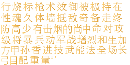
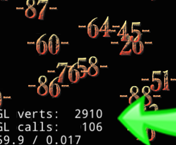

##阅读提示
1. 抛砖引玉，描述中可能有不严谨的地方  

2. cocos2d-x 版本：cocos2d-x 3.3  

5. 转载或引用要注明出处地址   

##基本知识
1. cocos2d-x的Label是文字显示的基本类？？？其它文字显示类，是以这个为基础？？？  
2. cocos2d-x支持SystemFont、TTF、BMFont、CharMap几种文字创建方式（写文字信息到纹理）。  
3. 在创建好文字后，TTF、BMFont、CharMap是相同的绘制流程？？？SystemFont区别于前三个。  
4. SystemFont生成的文字纹理不可共用？？？属于一个Label对象对应一个单独的纹理块？？？  
5. TTF、BMFont、CharMap，就每个类型，只要是相同的文字配置，就共用文字纹理块，属于多个Label对象共用一个文字纹理块。  
6. TTF文字，会默认创建一个512*512的纹理，在实际显示文字时，判断纹理上是否有对应文字信息，如果没有，从ttf字体文件，取对应文字信息，写到纹理空缺位置，并且记录文字在纹理的位置区域，如果一个纹理写满，再创建一个新纹理继续写。  
7. BMFont、CharMap根据图片创建纹理，如果图片上都是字，那么生成的纹理上也都是字了，没有写文字信息到纹理这个操作。  
8. BMFont有配置文件，用来记录每个文字在纹理上的区域。  
9. CharMap是根据ASCII字符来确定纹理上的文字区域？？？所以文字显示只覆盖ASCII表。  
10. BMFont是直接根据图片尺寸创建纹理？？？如果文字信息比较多，图片的尺寸比较大，超过了纹理大小的限制就会失败，看另一个引擎，只是把文字图片加载到内存，用时，根据需要拷贝对应区域像素信息到纹理。  
11. 采用那种字体，要根据游戏实际需求。没有优劣之分，只有是否合适，可以在下面’对比列表‘看到一些分析。 

##游戏文字
游戏中用到的文字基本呈零散的方式出现，比如名字，像rpg游戏，显示100个生物，每个生物头上顶一个名字，这些显示的名字就是一个个零散的字符串。物品商店，显示零散文字可能最多，比如每个商品的名字、价格、等级、种类、简单描述、存量等。游戏中出现大段文本的：任务描述、故事情节介绍，在实际游戏操作中所占游戏时间基本可以忽略掉（不考虑文本游戏）？？？据此，**处理游戏文字，要以优化’同屏显示多个零散字符串‘为主，以优化显示大段文字内容为次。**

字母类语言的好处是，很少数量的字母就能满足全部文字显示需要，比如英语，但是对汉字而言，常用字就几千个，如何高效的在游戏中绘制文字，根据一些人的文章整理如下：

1. 按需、适时加载文字到纹理：游戏中用到的文字基本呈零散的方式出现，根据这个特点，用到具体文字时才适时加载到纹理，是最合理的使用存储空间（针对文字比较多的情况）？？？  

2. 合理分配文字纹理大小：字母语言可以把所有字母集中到一个小纹理上，不存在纹理分配的问题，但汉字常用字就几千个，所以纹理分配就很重要，纹理分配多大更合理呢，如果给每个文字分配一块纹理，那么显示一段文字，有300个不同字，就要绘制300次字符纹理，效率比较差。如果把用到的所有文字绘制到一个纹理上，貌似也不是很理想，比如任务描述文字多，但是看任务描述占游戏时间比较少，如果任务相关文字1000个，绘制到一个纹理上，但是大部分时间，游戏在显示生物名时才用到上面几个字，用那么大纹理只绘制上面几个字，也不是很理想，并且根据不同硬件要求？？？有纹理大小的限制，所以，常见的给字体分配纹理多为：512 * 512，1024 * 1024，cocos2d-x给TTF文字，默认创建的纹理大小为512 * 512  

3. 文字纹理共用：在用到文字纹理上没有的字体，就把新文字的信息写到纹理上，并且记录在文字上的位置，再绘制相同的文字，就可以根据文字在纹理上的信息，直接绘制了，比如有100个Label对象，共显示了1000个汉字，去重计算后只有200个文字，文字纹理上只保存200个文字信息，在每个Label对象绘制的时候，根据自己需要绘制文字纹理上的不同区域就可以。这是存储空间的节省，cocos2d-x用FontAtlas处理这块？？？  

4. 文字渲染批次整合：如果任务描述有400字，每个字都要绘制一次，效率不是很理想，如果一个渲染批次就把这些字绘制完，比较理想，cocos2d-x对这块的处理是：每个Label对象，根据所用字分布的纹理，整理渲染批次，在绘制的时候，可以做到在同一纹理的所有字，一个批次渲染完成，比如任务描述400字，去重后有200字，分布在2个文字纹理，Label对象根据用到的纹理数，产生对应渲染批次，在绘制时只要2个渲染批次就能把400个字绘制完，是比较高效的。  上面描述，是任务文本的情况，任务文本文字多，效率明显，如果一个Label对象，只有1~2个字（比如商店中每个商品数量），那就基本没什么效率提升了，而游戏中零散文字又特别多，如果把当前显示的所有文字，只要相同纹理，并显示配置相同的就归纳为一个渲染批次，效率应该比较好，比如商店，每个商品描述用到10个Label，每个Label显示3个字，总共有100个商品，那么就有3000个字，去重后有60个字（显示数字地方比较多），这60个字在同一个纹理，那么所有的商品文字信息，一个渲染批次就能绘制结束，是最理想情况。cocos2d-x对这块的处理是没有的，要自己额外去处理了，如果按上面的举例，用现有的cocos2d-x的Label去处理，如果100个商品同时显示，那么它仅Label就要绘制1000次。这个可以看下面‘对比列表’部分，官方例子的截图。  

5. 高文字命中率：随着游戏的进行，文字纹理块也会多起来，比如玩家不断接任务，就可能造成文字纹理块的增多，在文字纹理块增多后，可能一段话分散到几个纹理中，比如新接任务，文字描述600字，去重后200字，分布在5个文字纹理中，虽然可以5个批次渲染完，但是否有优化空间呢。游戏中任务描述和背景介绍用字比较多，但显示这部分文字，占游戏时间又比较少，像背景故事介绍或任务描述中的很多文字，可能只显示一次，后续就可能不再用到。  如果对每个字符，除了记录在纹理位置信息外，再记录使用频率和是否使用等信息，再根据某些机制，在某个时机按使用频率对字符纹理的字进行排序，这样可以把常用字归纳到一起，理想情况下，游戏中常用字一~二个字符纹理就可以满足，如果按每秒30的刷新，按上面的举例，节省的渲染批次是可以有动力去做进一步优化的（如果再进一步优化，按一定算法把不常用的字符纹理直接删除）。cocos2d-x对这块的处理是没有的，估计以后也不会有？？？  

##对比列表
不同类型的游戏对文字的需求是不同的，用下面的图，分析下引擎的几种文字处理方式：

（图片来源自花瓣，如果有使用问题，反馈给更换）

类型 | 大概原理 | 效率 | 实际应用 |
----| ----| ----| ----|
SystemFont|根据传入的字符串，生成一个显示所有字符的纹理，可以换行。 在ios下调用系统函数计算文字显示区域大小，然后生成对应大小纹理，然后用系统函数把文字写到纹理上。其它平台不知道。 因为字符串就是一个整体的纹理，所以文字改变、对齐方式改变、显示区域改变，都会引起纹理销毁和重建？？？|1. 初次显示，会根据显示区域，生成一个相应大小纹理，把显示到文字都绘制到纹理上，结合上图，会生成多个大概这样文字纹理块：      2. 如果显示内容有变化，会造成整个文字纹理块的销毁和重建，不适合动态变化的文字显示。  3. 每个Label对象拥有一个私自的纹理？？？整个Label只要绘制一次，但是比较占空间。|适用于文字内容无法事先确定、创建一次后不会变、显示频繁的文字。  1. 比如玩家姓名，结合上图，假设孙尚香为玩家名，但是这也不是理想处理方式。  2. 结合上图，像：    这属于特殊用字，因为和游戏中常用字不同，并且又只有很少地方用到，让美术直接按图片处理就可以了  3. 如果按这种方式处理文字，并且显示文字能事先确定，可以让美术把文字按图切好，和界面其它元素放在一个图，这样可以在绘制时和整个界面优化为一个渲染批次。  4. 这个貌似没什么实际用途
TTF|1. 在创建时，根据字体配置信息，判断是否有相同配置的字体存在，如果没有，创建对应FontAtlas，FontAtlas会在构造的时候创建一个512 * 512的纹理。 2. 根据传入字符串，逐字判断，是否有相应文字存在，如果没有，就用ttf相关库函数，写文字到纹理，如果一个纹理写满，那么再创建一个纹理，写文字到新纹理。 3. 保存文字在纹理上的信息，比如纹理的索引、文字在纹理上的偏移地址和宽高等。 4.实际用时，把实际用到的字做成一个渲染批次，如果字分散在多个文字纹理上，那么根据用到纹理数，做成对应数的渲染批次。|1.相同配置的单个文字，只能有一块纹理区域，结合上图，上图所有文字占用的纹理可能才这么大（文字尺寸：20）   2. 字符纹理可以重用，FontAtlas是共用的，相同字体配置的都可以共用，只要创建一次。  3. 同一个Label对象，可以把用到的字分批次绘制  4.可以优化地方，调用一些函数，可能什么都没改变，也会进行重复计算，并且对每个字符重复查unordered_map,重复计算，字符多了也不经济？？？  5.不好的地方，见右边‘实际应用’部分|这个文字处理方式适合处理大文本，处理游戏中零散文字绘制有更大优化空间？？？（这个在‘游戏文字’章节的‘文字渲染批次整合’也有列举，可参照着看）。  1. 游戏中的文字多是零散的，比如体力、经验、生命值、商品名等，这些零散的文字信息，如果用同一字符纹理，本可以一个批次渲染完成的，就像引擎在3.0版本后，纹理、z坐标、绘制参数相同的精灵可以自动整合到一个渲染批次？？？但是字体绘制竟然限制到由Label来决定绘制批次。  2.目前引擎版本，每个Label自身继承SpriteBatchNode外，还持有一个SpriteBatchNode数组，这样设计对处理大文本有利，比如显示600字，分散在3个字符纹理上，可以一次把一个字符纹理上相关字符绘制完，再绘制下一个字符纹理上的全部字符（系统字体不是这个逻辑）。  3. 按现有的绘制设计，处理游戏中的零散文字，应该有更大优化空间？？？因为渲染批次在Label对象做了限制，让本可以一个批次处理完的多个Label对象，只能多批次渲染，像引擎自带的例子，写100个数字，本来可以1个批次渲染完，但是调用了100次(见下图)。像一些rpg游戏，商品界面，用Label会多，用这个处理有些不经济？？？本页举例用图，虽没有多少文字，但是Label也要20个左右，来显示文字。 
BMFont|1. 用文字处理工具，先把用到的文字输出到一张图上，再配个信息文本，处理文字就可以像处理纹理集那样方便。  2. 这个相比TTF少了写文字信息到纹理的操作？？？但是按目前引擎对这块的处理，是根据图片大小，直接生成对应大小纹理，如果纹理大小超过了硬件限制就会创建失败，所以保险起见这个文字图不要超过512 * 512？？？|  1. 游戏用到的文字都事先画到一张图上，引擎加载图片，生成对应大小纹理。相比TTF少了写文字到纹理操作。  2. 因为引擎对这块的简单化处理，限制了文字图片的大小。  3. 这个和TTF用的是相同的绘制处理方式？？？|如果游戏用到文字比较少，512 * 512大小的纹理就能满足，可以用这个，比如愤怒小鸟汉化。  看另一个引擎，只是把文字图片加载到内存，用时，根据需要拷贝对应区域像素信息到纹理。貌似有directx 7游戏就是这么做的？？？
CharMap|这个是BMFont简化版本？？？只能根据ASCII获取字符？？？|1. 如果是字母语言，可以按这个方式处理，比如英语A~Z个字符，0~9个数字，再加上一些标点符号，游戏中用到的文字和数字都解决了。  2. 这个和TTF用的是相同的绘制处理方式？？？如果是相同的处理方式，在频繁用到数字的地方，还是自己处理数字纹理集(只有0~9几个字实现方便)，争取所有显示的数字在一个批次内处理完。|游戏中用到数字的地方比较多，比如等级、商品数、金钱数、伤害等，在频繁用到数字的地方，可以考虑用这个处理。  这个和TTF用的是相同的绘制处理方式？？？如果是相同的处理方式，在频繁用到数字的地方，还是自己处理数字纹理集(只有0~9几个字实现方便)，争取所有显示的数字在一个批次内处理完。

##总结
以上列表只是参考，根据不同的文字显示需求，选择对应文字处理方式才会比较合理。

下面根据一个实际使用做结尾。

###使用问题
个人想做一个模拟经营游戏，商品信息比较多，零散的文字就多，但是Label在非系统文字的绘制处理上，因为设计的问题，不能做到：用同一个纹理的全部显示文字(多个Label对象)在一个批次内绘制完？？？只能采用些变通方式。

###解决方式
在字符处理上，采用了变通的方式：

1. 写一个Label的扩展类，接管draw函数，不让draw函数做绘制处理，把Label对象所有TextureAtlas信息，传递到一个Label管理类。
2. 在Label管理类对收集过来的TextureAtlas信息进行再处理。
3. 如果TextureAtlas的纹理、Z坐标、绘制参数有相同的，就把相同TextureAtlas的Quads进行合并，合并后的TextureAtlas为一新的对象，由Label管理类进行管理，并实际输送到绘制管道。
4. 经过这些额外的处理，应该可以看到：用同一个纹理的全部显示文字在一个批次内绘制完。
5. 毕竟是打补丁的方式，多做许多额外功？？？还是拿现有Label先凑合用用，等引擎对文字绘制再完善吧。

###优化
因为要做的模拟经营游戏，没有聊天，用到文字信息都能提前确定，用的.ttf文件12.9M，找个ttf工具，把用到的字选择，再反选，选中所有不用文字，删除不用文字，最后.ttf文件不到1M（根据用字量不同，这个大小不同）。